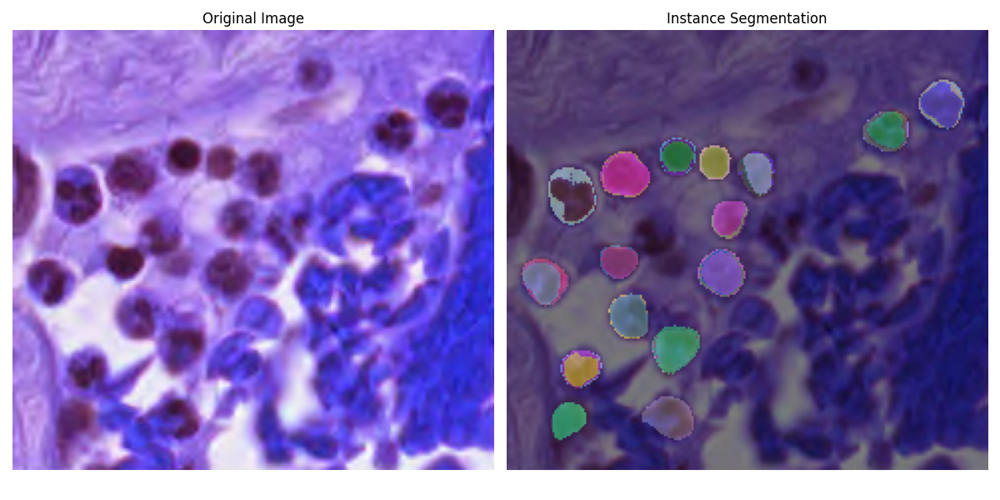
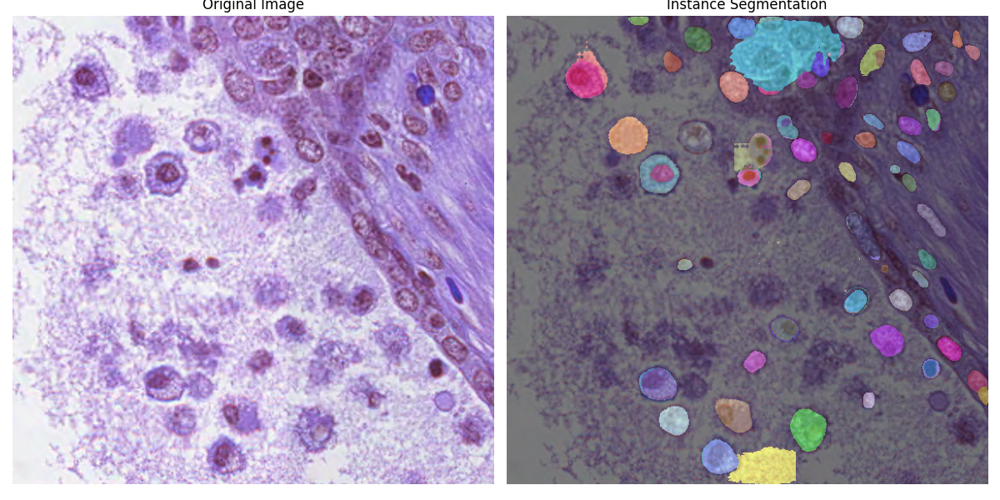

# 2025VRDL-hw3
2025 Visual Recognition using Deep Learning hw3
Student id: 313551056
Name: 王力得

## Introduction
This repository implement a cell instance segmentation task with mask-rcnn. It may achieve 0.21 mAP on the public test data.
## Installation
This project runs on python version 3.10.16 with cuda 12.6. It is recommended to use Conda to create a virtual environment.

1. clone the repository and enter the directory by the following command (you may need to install 'git', or alternatively you may download the zip file from the github website):

```bash
git clone https://github.com/n9maple/2025VRDL-hw3.git
```

2. Create a virtual environment with Conda:

```bash
conda create -n hw3 python=3.10.16
```

3. Activate the environment and download the packages:

```bash
conda activate hw3
pip install requirements.txt # Make sure you are using cuda 12.6
```

## Run the code
Please make sure you have download the dataset and the dataset are orginized. The directory should be like:
```bash
data
├── test_image_name_to_ids.json
├── test_release
│   ├── 0bd26f8e-81f6-4267-82ad-740e2786393a.tif
│   ├── 0fb9d9c0-f786-49c5-b485-b8dfdcce929c.tif
│   ├── 01ce9840-ea96-495e-8fd1-696a734956af.tif
    ...
└── train
    ├── 0aaa252e-b503-4503-bdc6-387a5cfe2622
    ├── 0bacdb96-9964-4920-a645-683683d4559c
    ├── 0e40f304-706b-40c4-8ac6-c52c384e25b9
    ...

```
1. Activate the environment

```bash
conda activate hw3
```

2. Run the training code.
```bash
python train.py
```
By default, you don't need to add any arguments to run train.py, but you can check the arguments list by the following command:

```bash
python train.py -h
```

3. Run the inference code. If you have run train.py, you may ignore all the arguments and run inference.py. Otherwise, if the model weight path is not given, it will find *'save_model/model_epoch10.pth'*. You may download the weight from the link: 
https://drive.google.com/file/d/1Pxk4rW4FRhF2jMKQQLBNAk2mZWKath88/view?usp=sharing

```bash
# if you don't specify the saving folder in training
python inference.py
```
or

```bash
# if you set argument "--save_dir your_model_path" to specify the saving folder in training, or you don't want to use "model_epoch10.pth".
python prediction.py --model_path [your_model_path]
```

The prediction results will be saved in "save_result" folder by default (this can be changed by setting "--save_dir").

## Performance Snapshot

<figure>
  
</figure>

<figure>
  
</figure>